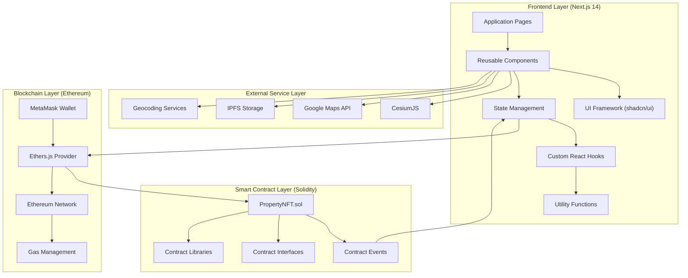
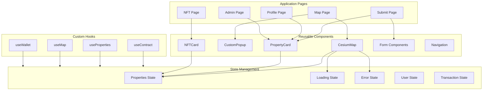
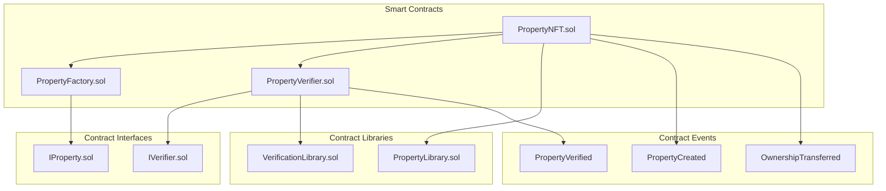
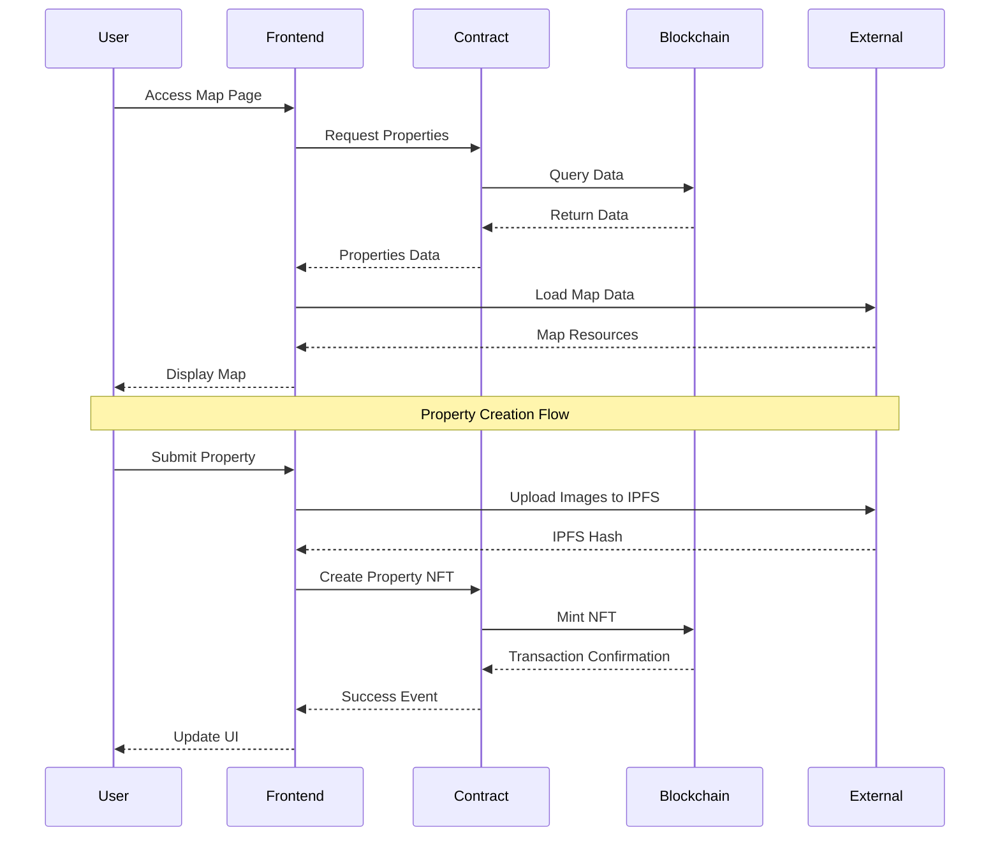
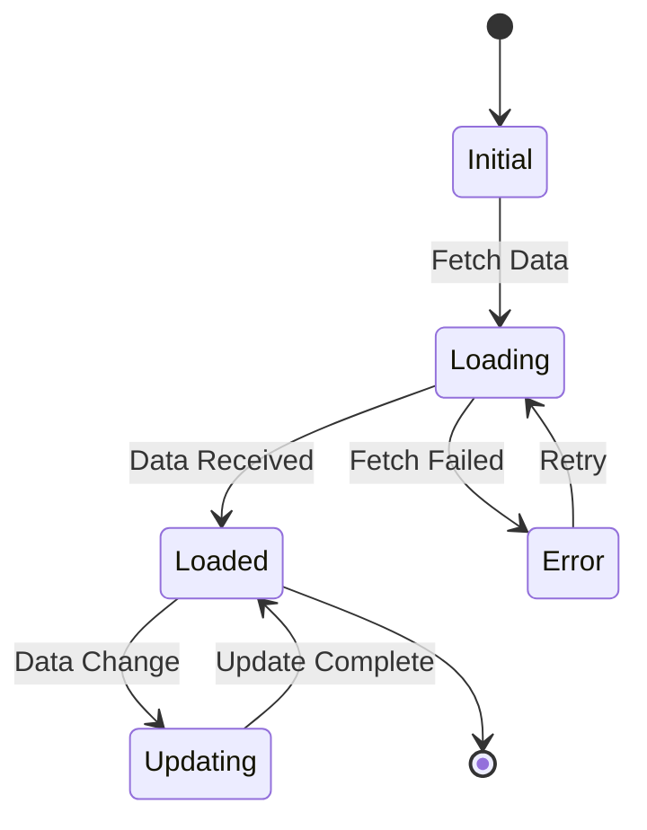

# Property NFT Platform: A Decentralized Real Estate Tokenization System

## Abstract

This document presents a comprehensive technical architecture for a decentralized real estate tokenization platform that leverages blockchain technology and 3D geospatial visualization. The system enables the creation, verification, and trading of property-based NFTs while providing an immersive 3D interface for property exploration.

## 1. System Architecture Overview

### 1.1 High-Level Architecture

### 1.2 Component Interaction Matrix

| Component | Frontend | Smart Contract | External Services | Blockchain |
|-----------|----------|----------------|-------------------|------------|
| Frontend | Internal Communication | Contract Calls | API Integration | Wallet Connection |
| Smart Contract | Event Emission | Internal Logic | - | State Changes |
| External Services | Data Consumption | - | Service Integration | - |
| Blockchain | Transaction Signing | State Updates | - | Network Operations |

## 2. Detailed Component Architecture

### 2.1 Frontend Components

### 2.2 Smart Contract Architecture

## 3. Data Flow and State Management

### 3.1 Data Flow Sequence

### 3.2 State Management Flow

## 4. Technology Stack and Implementation Details

### 4.1 Frontend Technologies
- **Framework**: Next.js 14
  - Server-side rendering
  - API routes
  - Dynamic imports
- **UI Library**: shadcn/ui
  - Component-based architecture
  - Theme customization
  - Accessibility features
- **State Management**: React Hooks
  - Custom hooks for data fetching
  - Context API for global state
  - Local state for component-specific data

### 4.2 Smart Contract Technologies
- **Language**: Solidity 0.8.x
  - Inheritance patterns
  - Interface implementation
  - Library integration
- **Development Tools**:
  - Hardhat
  - OpenZeppelin
  - Ethers.js

### 4.3 External Services
- **3D Visualization**: CesiumJS
  - 3D terrain rendering
  - Custom entity management
  - Camera controls
- **Geocoding**: Google Maps API
  - Address validation
  - Reverse geocoding
  - Street view integration
- **Storage**: IPFS
  - Image storage
  - Metadata storage
  - Content addressing

### 4.4 Blockchain Integration
- **Wallet**: MetaMask
  - Account management
  - Transaction signing
  - Network switching
- **Provider**: Ethers.js
  - Contract interaction
  - Event listening
  - Transaction management

## 5. Security Considerations

### 5.1 Smart Contract Security
- Access control mechanisms
- Input validation
- Reentrancy protection
- Gas optimization

### 5.2 Frontend Security
- Input sanitization
- XSS prevention
- CSRF protection
- Secure storage

### 5.3 Data Security
- IPFS content verification
- Metadata integrity
- Access control
- Data encryption

## 6. Performance Optimization

### 6.1 Frontend Optimization
- Code splitting
- Lazy loading
- Image optimization
- Caching strategies

### 6.2 Smart Contract Optimization
- Gas-efficient operations
- Batch processing
- Event optimization
- Storage optimization

### 6.3 Map Performance
- Level of detail management
- Entity clustering
- Texture compression
- View frustum culling

## 7. Future Enhancements

### 7.1 Planned Features
- Advanced property analytics
- Automated verification system
- Community governance
- Cross-chain integration

### 7.2 Scalability Improvements
- Layer 2 solutions
- Sharding implementation
- Caching layer
- CDN integration

## 8. Conclusion

This architecture provides a robust foundation for a decentralized real estate tokenization platform, combining blockchain technology with advanced 3D visualization capabilities. The system's modular design allows for future enhancements while maintaining security and performance standards. 