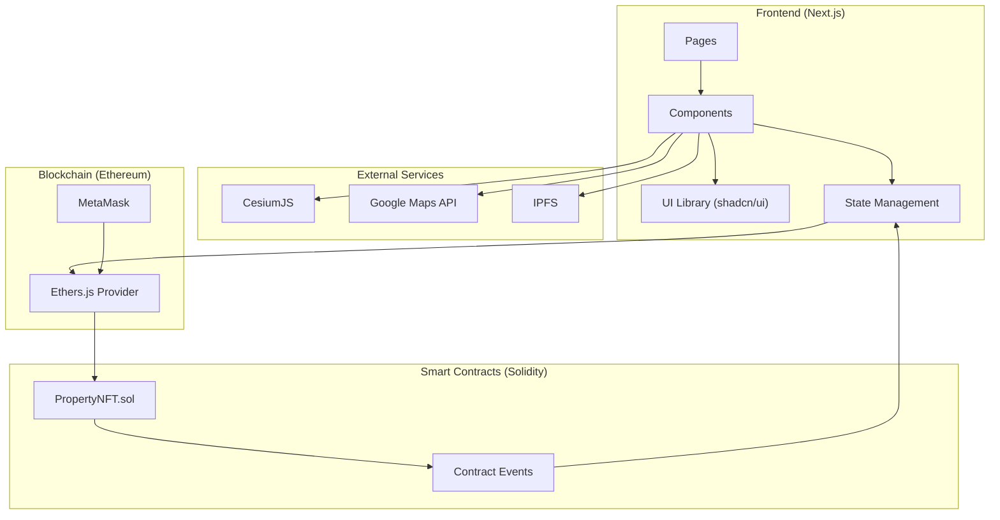
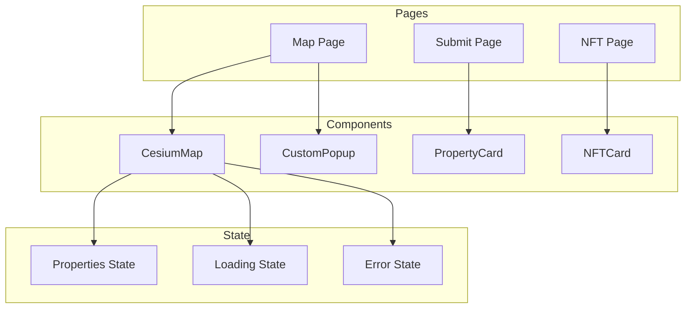
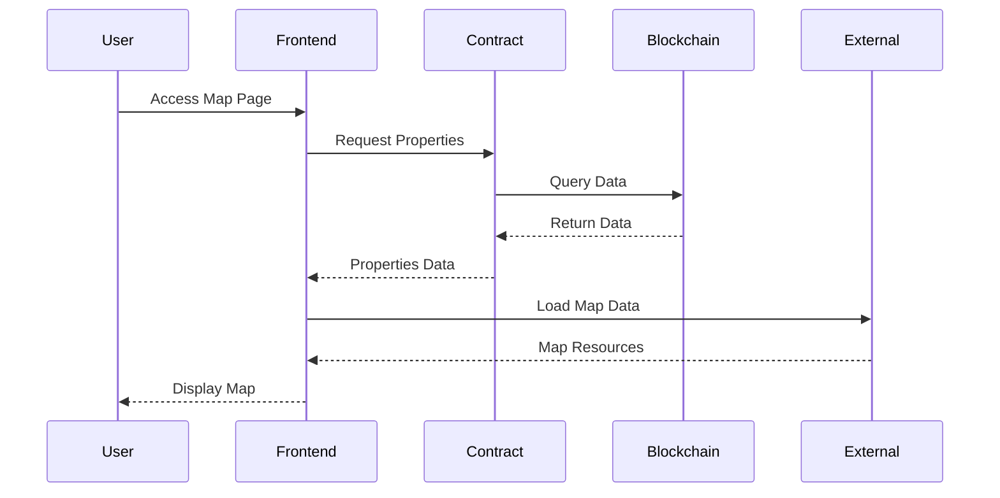

# Property NFT Platform Technical Architecture

## System Overview

## Component Details

### Frontend Components

## Data Flow

## Technology Stack

- **Frontend Framework**: Next.js 14
- **UI Library**: shadcn/ui
- **Smart Contract**: Solidity
- **Blockchain Interaction**: Ethers.js
- **3D Map**: CesiumJS
- **Geocoding**: Google Maps API
- **Storage**: IPFS
- **Wallet**: MetaMask

## Key Features

1. **Interactive 3D Map**
   - CesiumJS integration
   - Property markers
   - Community boundaries
   - Street view integration

2. **Smart Contract Integration**
   - Property NFT minting
   - Property verification
   - Ownership management

3. **User Interface**
   - Responsive design
   - Loading states
   - Error handling
   - Interactive popups

4. **Data Management**
   - Real-time updates
   - State management
   - Data persistence 